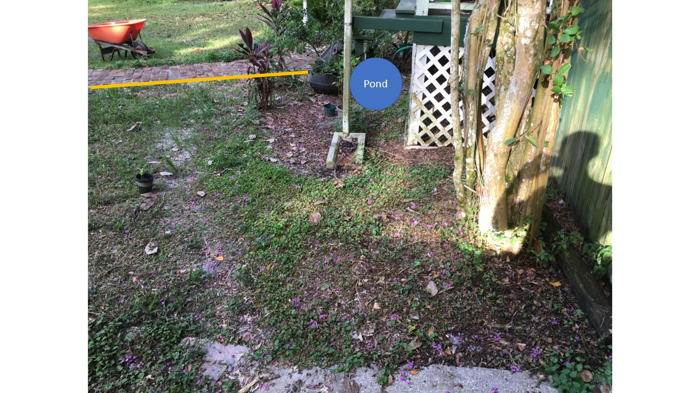
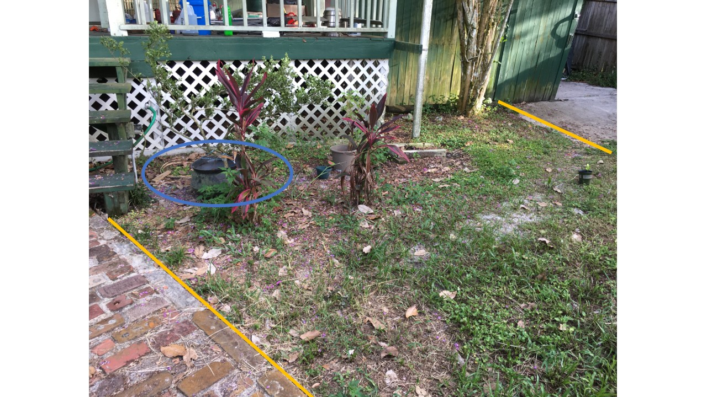
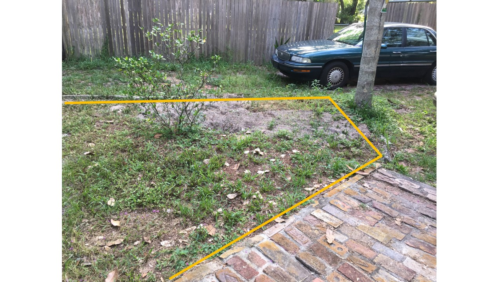
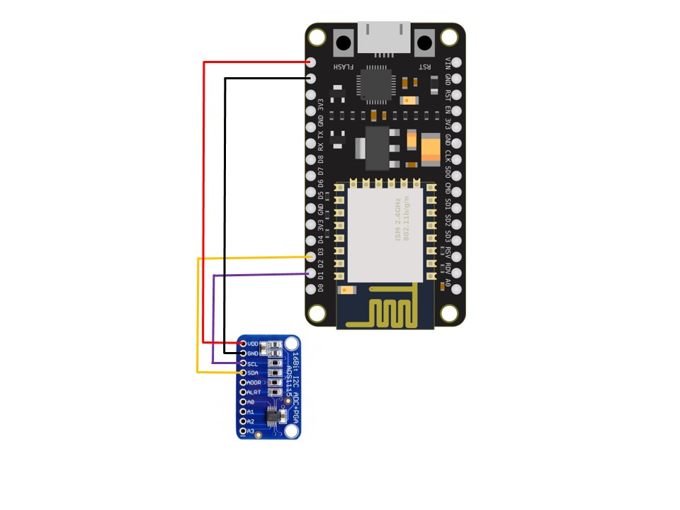
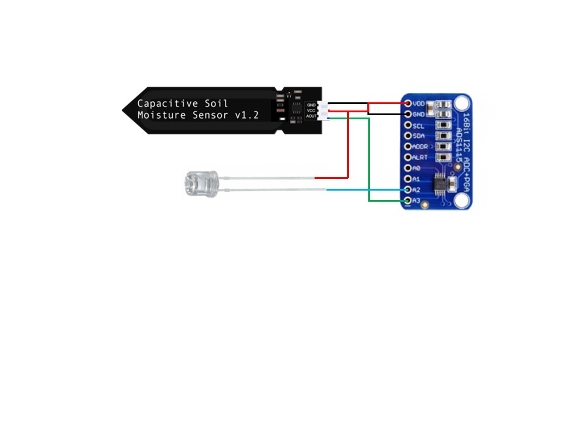
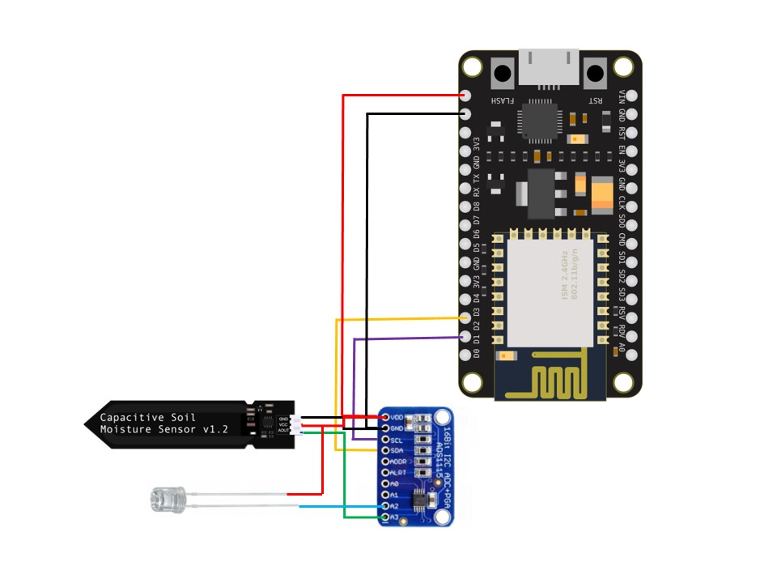

# Automated_Garden
Documented here is my journey of creating an automated garden during the 2020 COVID-19 outbreak. The goal of this project is to create a modular system capable of automating various gardening tasks, namely watering the plants. Over the course of the project, I will update this section to include new developments as they arise.

This project started in the beginning of July with the decision to overhaul one of our existing flower beds that had gone neglected over the years. As can be seen from the _Before_ pictures, the area is covered with weeds and an assortment of plants. The dirt mound is from the relocation of a Cedar tree to another location. 

Below I will highlight the individual aspects of the garden and system: Landscaping, Sensor Stations, and Automated Watering.

## Landscaping
While this section has little to do with IoT, this is a crucial area as the system's design had to take the following into account. The three images below may help one visualize the planned changes.

In the corner of the front porch, I would like to dig out an area to create an amphibian conservation area, inspired by this [project](https://www.youtube.com/watch?v=LcuZqJbXanA). Behind this area, I would like to place taller plants and flank the rest of the porch in rose bushes. 

The remainder of the flower bed is still yet to be planned but is reliant on one main factor: What plants will fair best? In order to find this out, I must gather data on the garden such as sun exposure and soil moisture.

## Sensor Stations
Before undertaking the landscaping portion of this project, I need to gain insight to the conditions that the plants would be subject to. My solution to this is to develop a sensor station capable of recording data for up to a week. These stations will be placed in various areas to create a rough [sun-map of the garden]( https://www.gardenfundamentals.com/sun-mapping-garden/). Once I have selected the desired plants, I can use the stations to find the best possible place to place the plants. 

Each station will consist of a phototransistor and a capacitive soil moisture sensor. At _this_ time, I'm leaning towards using an ESP8266 to store the sensor data to flash memory and posting to a server once the onboard memory is full. The station will be powered by a simple power supply and the contents all being contained in a weather proof box. 

To address the (expected to be) drastic variation in sun exposure, I plan to use a logarithmic funtion to normalize the phototransistor readings. In addition, the sensor readings will only be recorded hourly as to improve battery life.

Below are figures showing the preliminary circuit for the Sensor Stations. At the heart of the station is an ESP12-E connected to an ADS1115 to expand the available analog inputs. Attached to the ADS1115 are a capacitive soil moisture sensor and a photodiode.

## Automated Watering
To perform the task of watering, the system must analyze data such as soil moisture and sun exposure. When the soil is too dry [(<= 15%)](https://www.acurite.com/blog/soil-moisture-guide-for-plants-and-vegetables.html), the system powers on the soaker hose. If sun exposure is low, indicating an approaching storm, the system waits until the sun exposure increases. In the future, I would like to incorporate actual weather data. 
