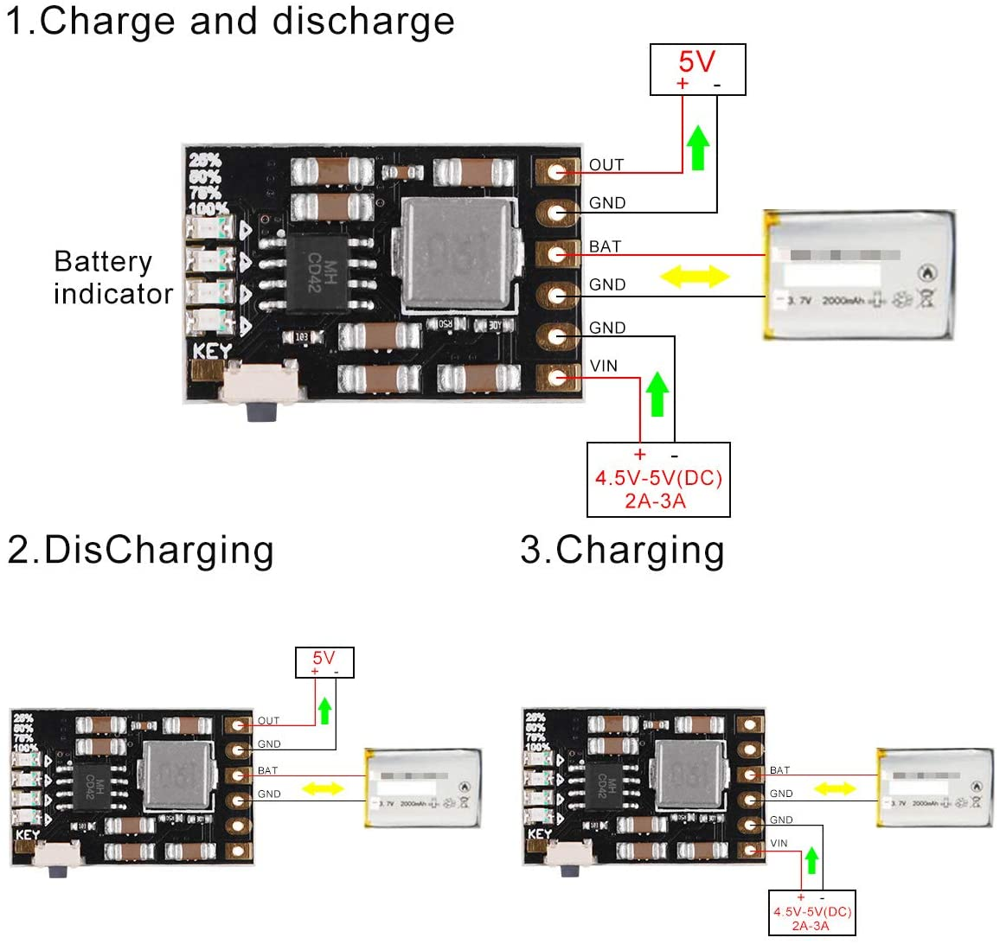

# Automated_Garden
Documented here is my journey of creating an automated garden during the 2020 COVID-19 outbreak. The goal of this project is to create a modular system capable of automating various gardening tasks, namely watering the plants. Over the course of the project, I will update this section to include new developments as they arise.

This project started in the beginning of July with the decision to overhaul one of our existing flower beds that had gone neglected over the years. As can be seen from the _Before_ pictures, the area is covered with weeds and an assortment of plants. The dirt mound is from the relocation of a Cedar tree to another location. 

Below I will highlight the individual aspects of the garden and system: Landscaping, Sensor Stations, and Automated Watering.

## Landscaping
While this section has little to do with IoT, this is a crucial area as the system's design had to take the following into account. The three images below may help one visualize the planned changes.

In the corner of the front porch, I would like to dig out an area to create an amphibian conservation area, inspired by this [project](https://www.youtube.com/watch?v=LcuZqJbXanA). Behind this area, I would like to place taller plants and flank the rest of the porch in rose bushes. 

The remainder of the flower bed is still yet to be planned but is reliant on one main factor: What plants will fair best? In order to find this out, I must gather data on the garden such as sun exposure and soil moisture.

## Sensor Stations
Before undertaking the landscaping portion of this project, I need to gain insight to the conditions that the plants would be subject to. My solution to this is to develop a sensor station capable of recording data for days at a time. These stations will be placed in various areas to create a rough [sun-map of the garden]( https://www.gardenfundamentals.com/sun-mapping-garden/). Once I've gathered data about the garden, I can then select plants that will be suitable for the environment. 

Each station will consist of a photoresistor and a capacitive soil moisture sensor. _Originally_, I had investigated using an ESP8266 to monitor and save sensor data in flash memory, sending the data to a server once memory was filled. The main issue I faced with the original approach was the lack of adequate [analog outputs](https://randomnerdtutorials.com/esp8266-pinout-reference-gpios/). As shown in the diagrams below, I had planned on using an ADC to expand the number analog outputs but was not keen on this solution due to the added cost and complexity associated with the extra component for each station.

To circumvent these issues, I opted to instead use an ESP32 at the heart of each station. These boards possess ample analog outputs in addition to the other features of the ESP8266, such as Wi-Fi connectivity and [power saving options](https://randomnerdtutorials.com/esp8266-deep-sleep-with-arduino-ide/). 

Powering saving options, such deep sleep, will extend the up time for each station - especially since they are powered via a single 18650 Li-ion battery. The Li-ion battery supplies a maximum of 4.2v when fully charged and drops to below 3v as the battery drains. To regulate the voltage, I added a 3.7v-4.7v to 5v boost converter. This board also possesses functionality for the inclusion of solar charging which would - theoretically - allow the station to operate independently for the life of the battery and/or components. This would be ideal as my objective is to develop a contemporary "garden tool" that would save me time and effort - not one that requires more maintence than the plants themselves!

## Automated Watering
To perform the task of watering, the system must analyze data such as soil moisture and sun exposure. When the soil is too dry [(<= 15%)](https://www.acurite.com/blog/soil-moisture-guide-for-plants-and-vegetables.html), the system powers on the soaker hose. If sun exposure is low, indicating an approaching storm, the system waits until the sun exposure increases. In the future, I would like to incorporate actual weather data. 
